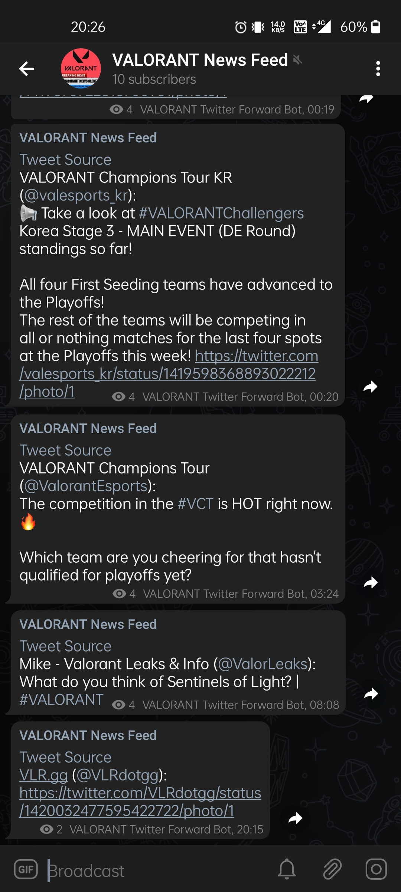
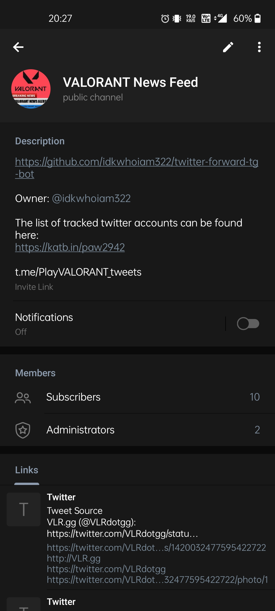

## Build Information
```
Name: twitter-forward-tg-bot
Version: 0.3.0
Author: idkwhoiam322
Description: A Telegram bot that forwards tweets from a list of users to a Telegram chat/channel
Repository: https://github.com/idkwhoiam322/twitter-forward-tg-bot
Associated Channel: t.me/PlayVALORANT_tweets
```

## How to use?
```
1) Ensure all of the following are set in your environment:
    - TELOXIDE_TOKEN = Telegram Bot token from t.me/BotFather
The next few should be obtained from twitter:
https://developer.twitter.com/en/portal/projects
    - CONSUMER_API_KEY
    - CONSUMER_API_SECRET_KEY
    - ACCESS_KEY
    - ACCESS_SECRET_KEY
Remember to write down the Twitter api keys somewhere as Twitter does NOT let you view them again.

Don't worry about missing out, you will be reminded when you try to run it!

2) Configure your own list of users in src/users.rs.
Use the one in this soure as an example.
```

## Image Preview:
<p align="left">

&nbsp;&nbsp;&nbsp;&nbsp;&nbsp;&nbsp;

</p>

Contact me: [Telegram](https://t.me/idkwhoiam322)
